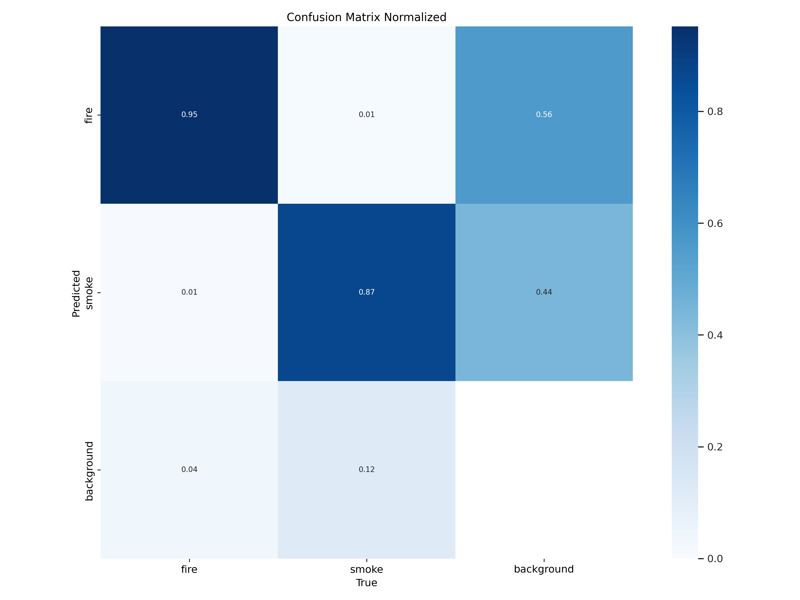
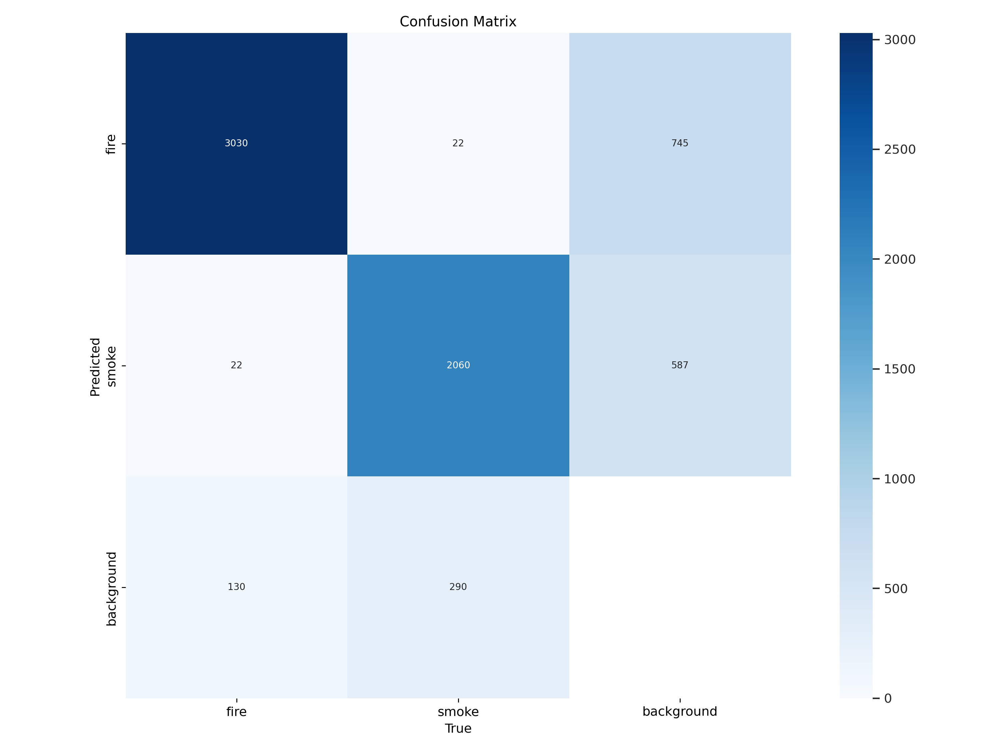
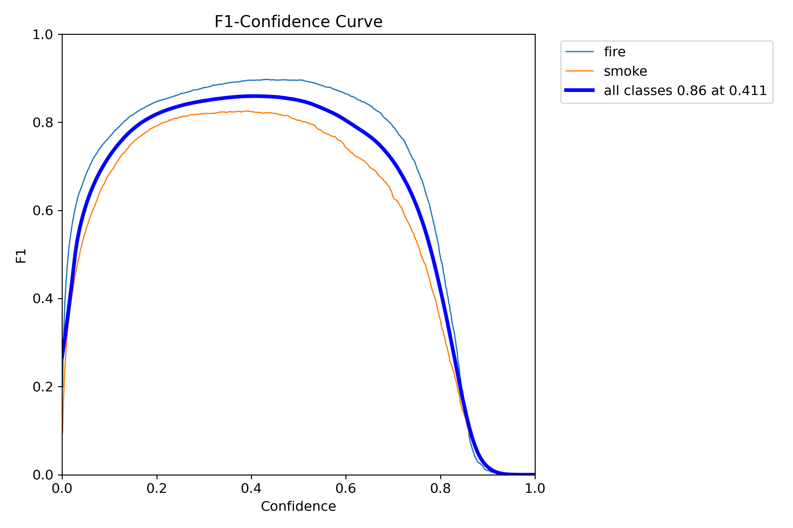
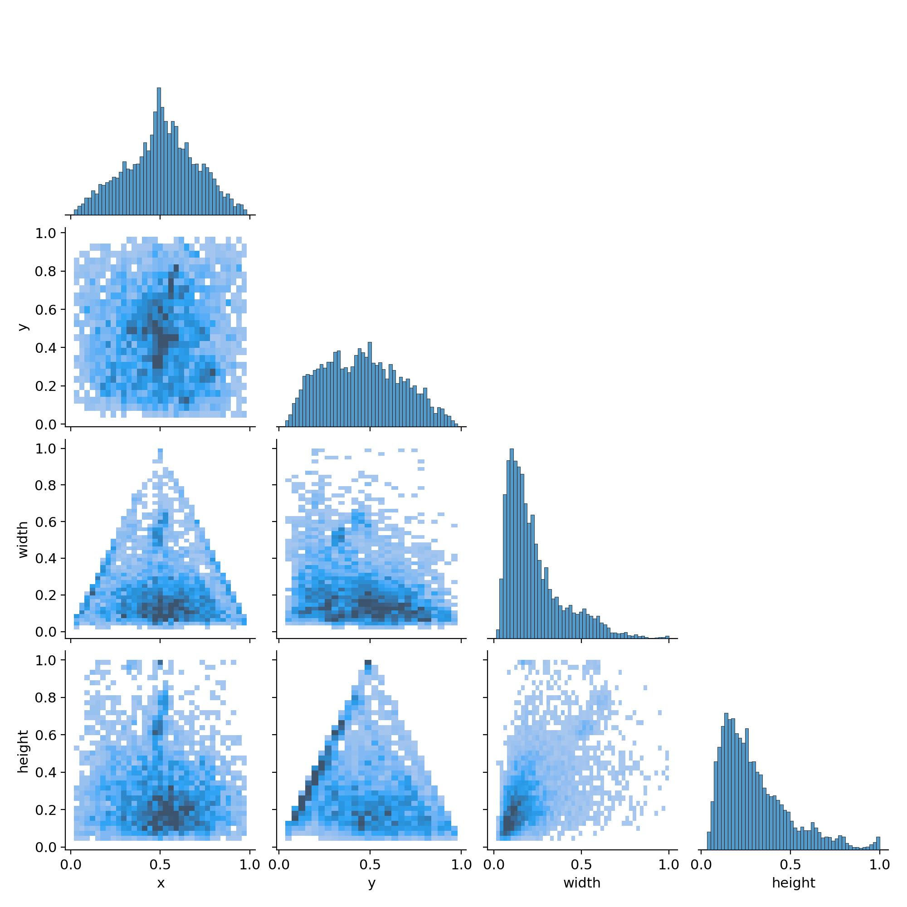

# Fire and Smoke Detection

This project uses a custom-trained YOLOv8 model to detect fire and smoke in live video, image files, or video files. When a fire or smoke event is detected, the system can save an alert snapshot and send an email notification with location details.

## Features

- Detects fire and smoke using a trained YOLOv8 model
- Supports webcam, image, video, and RTSP stream input
- Shows annotated detections in a live window when enabled
- Saves alert images to the alerts folder
- Sends SMTP email alerts with incident information
- Supports manual latitude/longitude override for location accuracy

## Project Structure

- main.py - Main detection pipeline, alert logic, and email sending
- requirements.txt - Python dependencies
- weights/best.pt - Trained YOLOv8 weights for fire and smoke detection
- args.yaml - Training configuration used for model training
- alerts/ - Folder where captured alert images are stored
- IMAGES/ - Sample images related to the training and validation workflow

## Requirements

- Python 3.10 or newer
- A working camera, video file, image file, or RTSP stream source

Install dependencies:

```bash
pip install -r requirements.txt
```

## Usage

Run the detector with the default model weights:

```bash
python main.py --weights weights/best.pt --show
```

Use your webcam:

```bash
python main.py --source 0 --weights weights/best.pt --show
```

Use a video or image file:

```bash
python main.py --source path/to/video.mp4 --weights weights/best.pt --show
python main.py --source path/to/image.jpg --weights weights/best.pt --show
```

## Email Alert Configuration

The script can send an email when fire or smoke is detected. Configure SMTP details either through command-line arguments or environment variables.

Example with environment variables:

```bash
set SMTP_SERVER=smtp.gmail.com
set SMTP_PORT=587
set SMTP_USER=your_email@gmail.com
set SMTP_PASSWORD=your_app_password
set FROM_EMAIL=your_email@gmail.com
set TO_EMAIL=recipient@example.com

python main.py --source 0 --weights weights/best.pt --show
```

You can also pass the values directly:

```bash
python main.py --source 0 --weights weights/best.pt \
  --smtp-server smtp.gmail.com \
  --smtp-port 587 \
  --smtp-user your_email@gmail.com \
  --smtp-password your_app_password \
  --from-email your_email@gmail.com \
  --to-email recipient@example.com \
  --show
```

## Location Handling

By default, the script attempts to estimate the location from IP-based geolocation. For more accurate coordinates, provide manual values:

```bash
python main.py --source 0 --weights weights/best.pt \
  --latitude 17.4136 \
  --longitude 82.1360 \
  --location-name "Your Location" \
  --show
```

Use --no-location if you do not want geolocation to be attempted.

## Output

- Alert images are saved in the alerts folder
- Email messages include a timestamp, location details, and the saved image attachment

## Notes

- The model weights file must be available in the weights folder
- Press ESC to close the live preview window
- The cooldown setting helps reduce repeated alerts from the same event

## Author

P Mukesh Sai

## Model Performance

The following metrics and charts summarize the trained YOLOv8 model performance. Add the corresponding images to the `metrics/` directory in the repository and they will render here on GitHub.

- Confusion Matrix (normalized):

  

- Confusion Matrix (counts):

  

- F1-Confidence Curve:

  

- Bounding box and dataset distribution plots:

  
